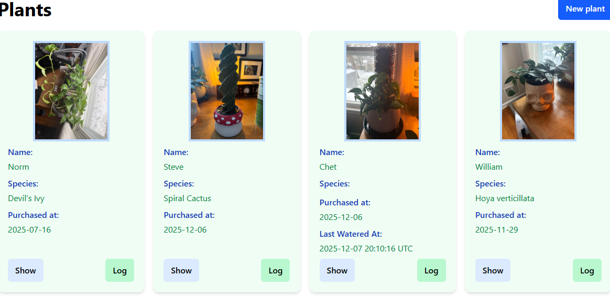

# README

# Plant Tracker

A simple Ruby on Rails + PostgreSQL app to track plants, mostly meant for me to keep track of when the were last watered and progress pics. 

# Image Exports

Theres a callback on `PlantLogs` and helpers on the `ImageExporter` service to move the progress pics out of docker to your local filesystem, just update `IMAGE_DIR` and the mounted volume in `docker-compose.yml`. I happen to be running this on a windows machine in wsl.